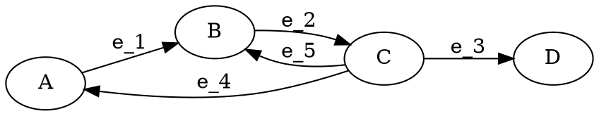

+++
title = "State Machines with XState"
author = ["Trent Fridey"]
date = 2020-11-14
tags = ["javascript", "front-end", "programming"]
draft = true
+++

## TODO Introduction to State Machines {#introduction-to-state-machines}

The formal specification of a finite state machine requires 5 parts:

1.  The set of states \\(S\\)
2.  The set of events \\(\Sigma\\)
3.  The set of valid transitions \\(\delta: S\times\Sigma \to S\\)
4.  The initial state \\(s\_0\\)
5.  The set of final states \\(F\\)

### Example {#example}

To illustrate this, let's consider a simple state machine with the following specification:

\begin{aligned}
S &= \\{ A, B, C, D \\} \\\\\\
\Sigma &= \\{ e\_1, e\_2, e\_3, e\_4, e\_5 \\} \\\\\\
s\_0 &= A \\\\\\
F &= \\{  D \\}
\end{aligned}

and transition function \\(\delta\\):

|   | e\_1 | e\_2 | e\_3 | e\_4 | e\_5 |
|---|------|------|------|------|------|
| A | B    |      |      |      |      |
| B |      | C    |      |      |      |
| C |      |      | D    | A    | B    |
| D |      |      |      |      |      |

We can visualize this FSM using a graph produced with the `graphviz` library:



## TODO Statecharts: an Extension to State Machines {#statecharts-an-extension-to-state-machines}

Statecharts are a group of extensions to state machines, that augment the features of state machines to make them easier to model.
These areas include hierarchy, concurrency, and communication.
Namely, in statecharts, you can have:

-   Hierarchical states
-   Orthogonal states
-   History states

or

statecharts = state-diagrams + depth + orthogonality + broadcast-communication

## TODO An Example {#an-example}

Tracking a feature in software development from initialization to deployment

Represent it as a graph

## TODO Implementing the Example with XState {#implementing-the-example-with-xstate}

XState is a Javascript library for implementing state machines in the browser.
Actually it implements state charts (an extension of state machines)
It is great because it follows a specification that has been sitting around for years as SCXML.

It allows us to generate an interactive representation of the state machine with `xstate-vis`.

### TODO The Implementation {#the-implementation}

Include link to code sandbox?

## Notes {#notes}

Constructing a hieararch
